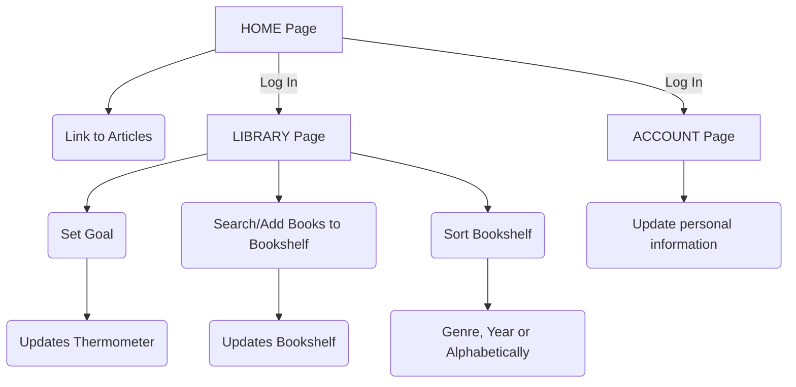

 

# Mini Project 1

## Flow chart:

 

_Write your mermaid flow-chart below:_

```mermaid
graph TD
  A[HOME Page] --> B(Link to Articles)
  A[HOME Page] --> |Log In|C[LIBRARY Page]
  A[HOME Page] --> |Log In|D[ACCOUNT Page]
  C --> E(Set Goal)
  E --> F(Updates Thermometer)
  C --> G(Search/Add Books to Bookshelf)
  C --> H(Sort Bookshelf)
  G --> I(Updates Bookshelf)
  H --> J(Genre, Year or Alphabetically)
  D --> K(Update personal information)
```
